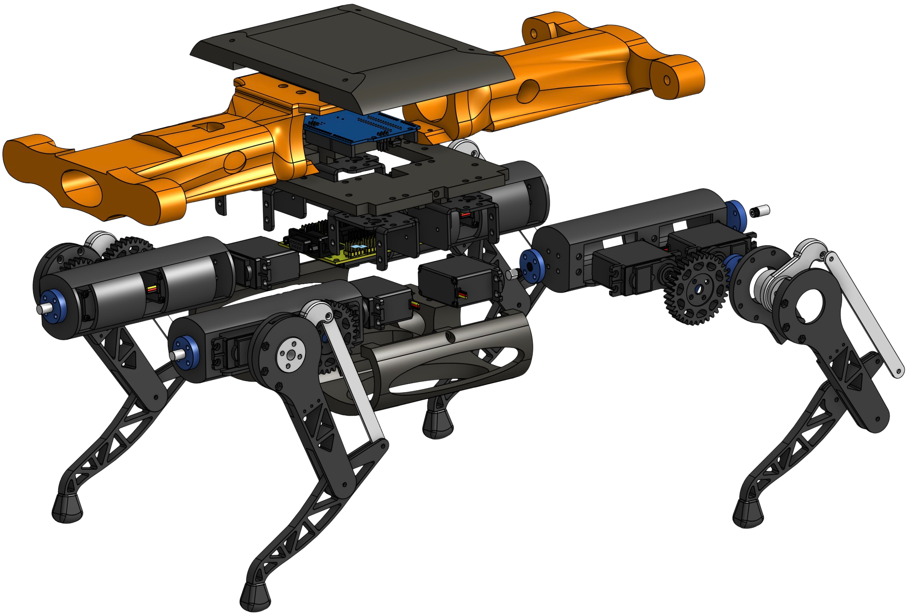
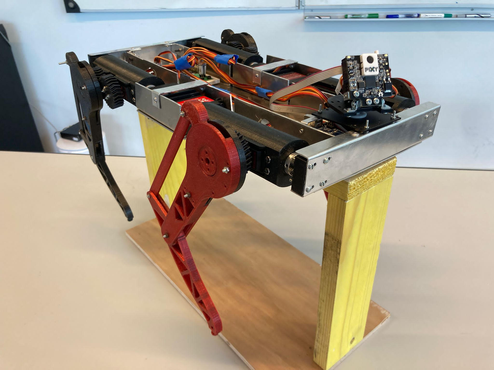

<h1 align="center">
  
</h1>

<h5 align="center">
    
  
</h5>
 

  Hi, my name is Hugo DURAND, I live in the south west of France. 
  I am currently a student in Robotics engineering at Polytech Nice-Sophia.
  I completed my two years of preparatory cycle of Polytech with a national network ranking of 146/1567 students.
  

### 🛠 &nbsp;Tech Stack

&nbsp;
&nbsp;
&nbsp;
&nbsp;
&nbsp;
&nbsp;
/
&nbsp;
&nbsp;
&nbsp;
    

<h2 align=center> Arduino Project </h2>

<h3> 1. Polydog Robot</h3>

As part of the Arduino courses in 2nd year of preparatory class, Raphael (<a href="https://github.com/neoteristis/" title="Raphael Anjou Profile">neoteristis</a>) and I built a dog robot with 3D printing, Arduino hardware and C++ code.
This is the first version of our robot :

| Polydog Exploded View   |      Polydog Walk     |
|:----------:|:-------------:|
|  |   |

Now we are working on a new version in our free time, with higher torque servo motors, stronger gearing, larger leg and aluminum body :

For more information :  
    

<h4 align="center">
  <a href="https://github.com/HAND42?tab=repositories" title="Show Repositories">🔎 Show More 🔍</a>
</h4>
